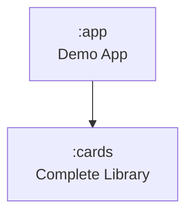

# Component Dependencies

## Module Dependency Graph



## Component Dependency Matrix

| Component | Depends On | Depended By |
|-----------|-----------|-------------|
| CardSchemaParser | Models (element types, action types) | CometChatCardView, CometChatCardComposable |
| ElementRegistry | CometChatCardElementRenderer interface | CometChatCardView, CometChatCardComposable, Layout Renderers |
| ThemeResolver | DefaultTheme, CometChatCardThemeOverride, CometChatCardColorValue | CometChatCardView, CometChatCardComposable, All Renderers (via RenderContext) |
| DefaultTheme | CometChatCardColorValue | ThemeResolver |
| ActionEmitter | CometChatCardAction, CometChatCardActionCallback, CometChatCardActionEvent | Interactive Renderers (Button, IconButton, Link), Markdown Renderer |
| Logger | — (standalone) | All components |
| RenderContext | ThemeResolver, ActionEmitter, LoadingStateManager, Logger | All Renderers |
| ElementRenderers (×20) | RenderContext, Models | ElementRegistry |
| Layout Renderers (×5) | ElementRegistry (for recursive rendering), RenderContext | ElementRegistry |
| CometChatCardView | CardSchemaParser, ElementRegistry, ThemeResolver, RenderContext, LoadingStateManager, Logger | Consumer (app module) |
| CometChatCardComposable | CardSchemaParser, ElementRegistry, ThemeResolver, RenderContext, LoadingStateManager, Logger | Consumer (app module) |
| LoadingStateManager | — (standalone) | CometChatCardView, CometChatCardComposable, Interactive Renderers |

## Communication Patterns

### Data Flow (Unidirectional)
```
JSON String → Parser → CardSchema → ThemeResolver → RenderContext → Renderers → Native Views
```

### Action Flow (Event Emission)
```
User Tap → Interactive Renderer → ActionEmitter → ActionCallback (consumer)
```

### Theme Flow
```
ThemeMode + DefaultTheme + ThemeOverride → ThemeResolver → ResolvedTheme → RenderContext → Renderers
```

## Package Structure

```
:cards/
  com.cometchat.cards/              ← CometChatCardView, CometChatCardComposable (public API)
  com.cometchat.cards.models/       ← CardSchema, 20 element types, 9 action types, ContainerStyle, ColorValue, Padding
  com.cometchat.cards.parser/       ← CardSchemaParser, SerializersModule config
  com.cometchat.cards.theme/        ← ThemeResolver, DefaultTheme, ThemeOverride, ResolvedTheme
  com.cometchat.cards.actions/      ← ActionEmitter, ActionCallback, ActionEvent
  com.cometchat.cards.core/         ← ElementRegistry, RenderContext, Logger, LoadingStateManager, LogLevel, ThemeMode
  com.cometchat.cards.renderers/    ← 20 element renderers (each with renderView + RenderComposable)
```
