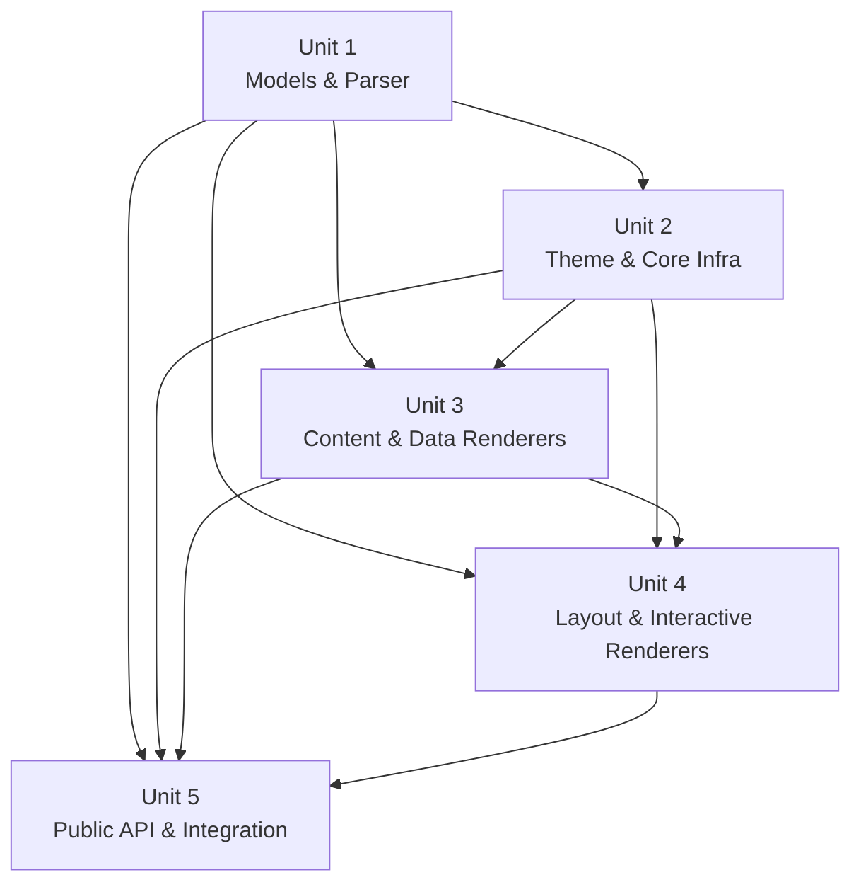

# Unit of Work Dependency Matrix

## Dependency Graph



## Dependency Matrix

| Unit | Depends On | Depended By | Can Parallelize With |
|------|-----------|-------------|---------------------|
| Unit 1: Models & Parser | — | Unit 2, 3, 4, 5 | None (must be first) |
| Unit 2: Theme & Core Infra | Unit 1 | Unit 3, 4, 5 | None (must follow Unit 1) |
| Unit 3: Content & Data Renderers | Unit 1, 2 | Unit 4, 5 | None (Unit 4 needs Unit 3 for layout children) |
| Unit 4: Layout & Interactive | Unit 1, 2, 3 | Unit 5 | None (depends on Unit 3) |
| Unit 5: Public API & Integration | Unit 1, 2, 3, 4 | — | None (must be last) |

## Critical Path

All units are sequential due to dependencies:
```
Unit 1 → Unit 2 → Unit 3 → Unit 4 → Unit 5
```

## Interface Contracts Between Units

| From | To | Contract |
|------|----|----------|
| Unit 1 → Unit 2 | Models | All element/action sealed classes, CardSchema, ColorValue, Padding, enums |
| Unit 1 → Unit 3,4 | Models | Element data classes used by renderers |
| Unit 2 → Unit 3,4 | Theme | ResolvedTheme, ThemeResolver for color/URL resolution |
| Unit 2 → Unit 3,4 | Core | RenderContext, ElementRegistry interface, ActionEmitter, Logger |
| Unit 3 → Unit 4 | Renderers | Content renderers registered in registry (layout children can be content elements) |
| Unit 2 → Unit 5 | Core | ElementRegistry (for initialization), LoadingStateManager |
| Unit 3,4 → Unit 5 | Renderers | All 20 renderers for registry population |
