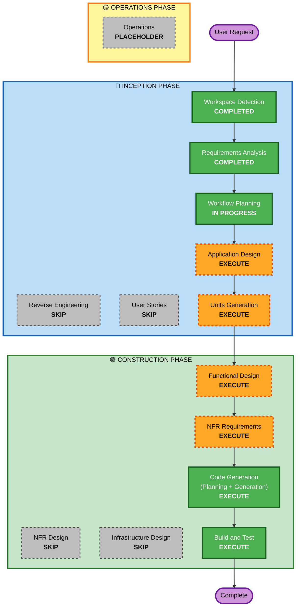

# Execution Plan

## Detailed Analysis Summary

### Change Impact Assessment
- **User-facing changes**: Yes — new library API surface for Android developers
- **Structural changes**: Yes — new `:cards` library module added to project
- **Data model changes**: Yes — 20 element types, 9 action types, ContainerStyle, ColorValue, Padding models
- **API changes**: Yes — new public API (CometChatCardView, CometChatCardComposable)
- **NFR impact**: Yes — performance target (100ms render), testing strategy (PBT + snapshots)

### Risk Assessment
- **Risk Level**: Medium
- **Rollback Complexity**: Easy (new module, no existing code modified)
- **Testing Complexity**: Complex (20 renderers, theme resolution, action emission, PBT)

## Workflow Visualization



### Text Alternative
```
Phase 1: INCEPTION
- Workspace Detection (COMPLETED)
- Reverse Engineering (SKIP — template project only)
- Requirements Analysis (COMPLETED)
- User Stories (SKIP — single developer, clear design doc)
- Workflow Planning (IN PROGRESS)
- Application Design (EXECUTE)
- Units Generation (EXECUTE)

Phase 2: CONSTRUCTION (per-unit loop)
- Functional Design (EXECUTE)
- NFR Requirements (EXECUTE)
- NFR Design (SKIP — library, no complex resilience patterns)
- Infrastructure Design (SKIP — library, not a deployed service)
- Code Generation (EXECUTE)
- Build and Test (EXECUTE)

Phase 3: OPERATIONS
- Operations (PLACEHOLDER)
```

## Phases to Execute

### 🔵 INCEPTION PHASE
- [x] Workspace Detection (COMPLETED)
- [x] Reverse Engineering - SKIP
  - **Rationale**: Only Android Studio template code exists, no business logic to reverse engineer
- [x] Requirements Analysis (COMPLETED)
- [x] User Stories - SKIP
  - **Rationale**: Single developer project with comprehensive design document and requirements. No multiple user personas or complex business requirements needing story decomposition.
- [x] Workflow Planning (IN PROGRESS)
- [ ] Application Design - EXECUTE
  - **Rationale**: New components needed (20 element renderers, registry, theme resolver, parser). Component interfaces and service layer design required.
- [ ] Units Generation - EXECUTE
  - **Rationale**: Library has clear logical modules (models, renderers, theme, actions, core) that benefit from unit decomposition for manageable implementation.

### 🟢 CONSTRUCTION PHASE
- [ ] Functional Design - EXECUTE (per-unit)
  - **Rationale**: Each unit has detailed business logic (parsing rules, rendering rules, theme resolution, action validation) that needs formal design.
- [ ] NFR Requirements - EXECUTE (per-unit)
  - **Rationale**: Performance targets, testing strategy (PBT + snapshots), and tech stack decisions need formal documentation.
- [ ] NFR Design - SKIP
  - **Rationale**: This is a rendering library, not a deployed service. No complex resilience patterns, scaling mechanisms, or infrastructure components needed.
- [ ] Infrastructure Design - SKIP
  - **Rationale**: Library is distributed as a Maven Central artifact. No cloud infrastructure, deployment targets, or networking to design.
- [ ] Code Generation - EXECUTE (ALWAYS)
  - **Rationale**: Implementation planning and code generation needed for all units.
- [ ] Build and Test - EXECUTE (ALWAYS)
  - **Rationale**: Build, test, and verification needed. PBT and snapshot testing required.

### 🟡 OPERATIONS PHASE
- [ ] Operations - PLACEHOLDER
  - **Rationale**: Future deployment and monitoring workflows

## Estimated Timeline
- **Total Stages to Execute**: 7 (Application Design, Units Generation, Functional Design, NFR Requirements, Code Generation, Build & Test, plus completed stages)
- **Estimated Duration**: Medium-large effort given 20 element types and dual API surface

## Success Criteria
- **Primary Goal**: Working Android library that renders Card Schema JSON into native views
- **Key Deliverables**: `:cards` library module with View + Compose APIs, unit tests, PBT tests, snapshot tests
- **Quality Gates**: 80% code coverage, all 28 correctness properties verified via PBT, Security Baseline compliance
