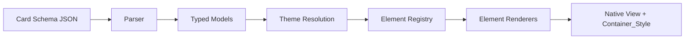
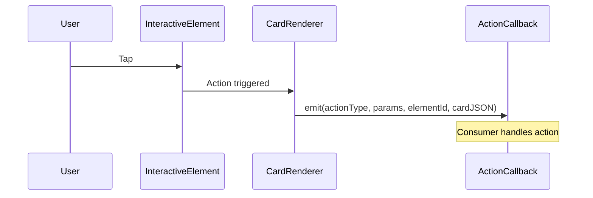
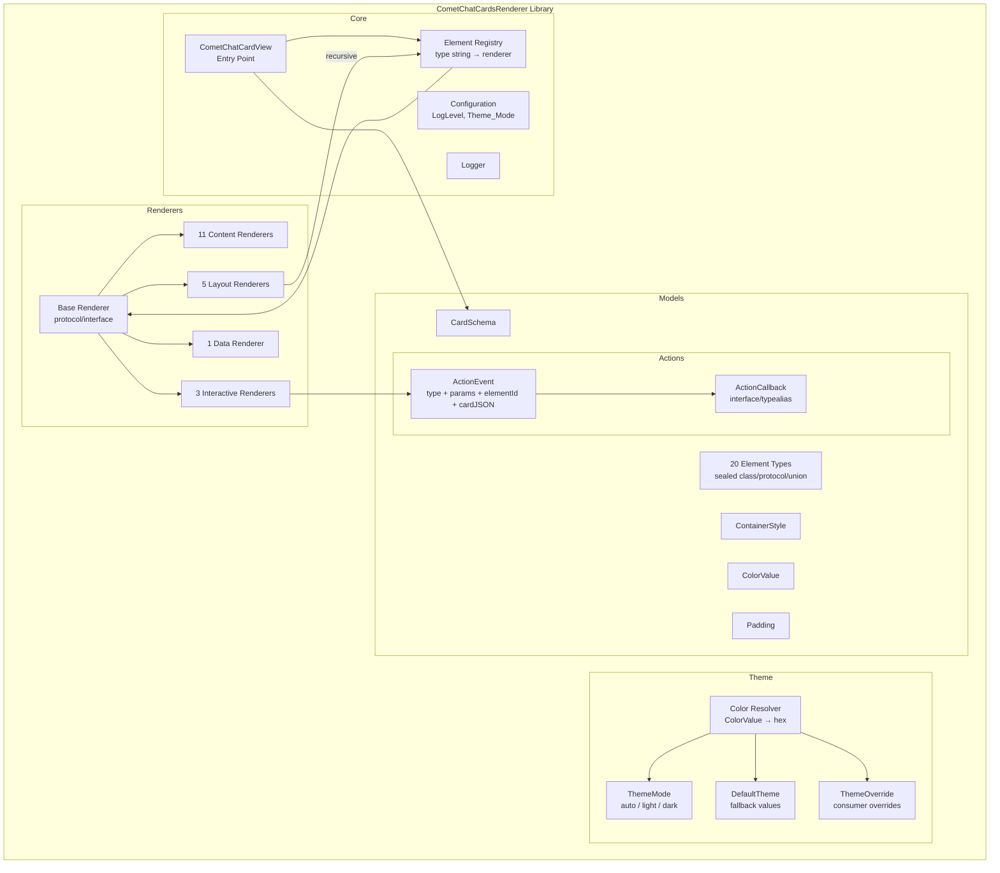

# Design Document: CometChatCardsRenderer

## Overview

CometChatCardsRenderer is a standalone cross-platform rendering library that converts Card Schema JSON into native platform views. The library follows a strict input/output contract:

- **Input**: Card_Schema JSON, Theme_Mode (auto | light | dark), optional Action_Callback, optional Theme_Override
- **Output**: Rendered native view hierarchy + Container_Style object

The library is a pure renderer — it does not execute actions, manage message lifecycle, or integrate with any SDK/UIKit layer. All interactive element taps are emitted to the consumer via the Action_Callback. The library ships as separate packages for Android, iOS, Flutter, Web (vanilla + React/Angular/Vue wrappers), and React Native.

### Rendering Pipeline



1. **Parser**: Deserializes JSON into platform-specific typed models using type-discriminated deserialization on the `type` field
2. **Typed Models**: Sealed class/protocol/union type hierarchy for all 20 element types and 9 action types
3. **Theme Resolution**: Resolves ColorValue objects and theme-aware URLs based on effective theme mode, applying Default_Theme fallbacks where JSON omits values
4. **Element Registry**: Maps element type strings to renderer implementations (registry pattern)
5. **Element Renderers**: Each renderer converts a typed model into a native view, recursing for layout elements
6. **Output**: The rendered view tree plus a Container_Style object extracted from the `style` field

### Action Emission Flow



When no Action_Callback is provided, taps are silently ignored (no-op).

## Architecture

### High-Level Architecture Diagram



### Registry Pattern

The core of the rendering engine is a registry — a `Map<String, ElementRenderer>` populated at initialization with all 20 built-in element renderers. When the body array is iterated, each element's `type` string is looked up in the registry to find the corresponding renderer. Unknown types are skipped silently.

Layout renderers (row, column, grid, accordion, tabs) hold a reference back to the registry (or the parent renderer) to recursively render their child elements. A depth counter is passed through recursive calls, enforcing the maximum nesting depth of 5 levels.

### Cross-Platform Module Structure

All platforms follow the same logical module organization:

```
cometchat-cards/
├── models/          # CardSchema, 20 element types, 9 action types, ContainerStyle, ColorValue, Padding
├── renderers/       # Base renderer interface + 20 element renderers
├── theme/           # ThemeMode, DefaultTheme, ThemeOverride, color resolution
├── actions/         # ActionCallback interface, ActionEvent model
└── core/            # CometChatCardView entry point, element registry, logger, configuration
```

Platform-specific file naming:
- **Kotlin**: PascalCase files (`CometChatCardView.kt`, `TextElementRenderer.kt`)
- **Swift**: PascalCase files (`CometChatCardView.swift`, `TextElementRenderer.swift`)
- **Dart**: snake_case files (`cometchat_card_view.dart`, `text_element_renderer.dart`)
- **TypeScript**: PascalCase files (`CometChatCardView.ts`, `TextElementRenderer.ts`)

## Components and Interfaces

### Platform-Specific Public API

#### Android (Kotlin) — `com.cometchat.cards`

```kotlin
// Traditional View API
class CometChatCardView @JvmOverloads constructor(
    context: Context,
    attrs: AttributeSet? = null
) : FrameLayout(context, attrs) {

    fun setCardSchema(json: String)
    fun setThemeMode(mode: CometChatCardThemeMode)
    fun setActionCallback(callback: CometChatCardActionCallback?)
    fun setThemeOverride(override: CometChatCardThemeOverride?)
    fun setLogLevel(level: CometChatCardLogLevel)
    fun setElementLoading(elementId: String, loading: Boolean)
    fun getContainerStyle(): CometChatCardContainerStyle?
}

// Jetpack Compose API
@Composable
fun CometChatCardComposable(
    cardJson: String,
    themeMode: CometChatCardThemeMode = CometChatCardThemeMode.AUTO,
    onAction: ((CometChatCardActionEvent) -> Unit)? = null,
    themeOverride: CometChatCardThemeOverride? = null,
    logLevel: CometChatCardLogLevel = CometChatCardLogLevel.WARNING,
    onContainerStyle: ((CometChatCardContainerStyle) -> Unit)? = null
)
```

#### iOS (Swift) — `CometChatCards` module

```swift
// UIKit API
public class CometChatCardView: UIView {
    public var cardJson: String? { didSet { render() } }
    public var themeMode: CometChatCardThemeMode = .auto { didSet { render() } }
    public var actionCallback: CometChatCardActionCallback?
    public var themeOverride: CometChatCardThemeOverride?
    public var logLevel: CometChatCardLogLevel = .warning
    public func setElementLoading(_ elementId: String, loading: Bool)
    public var containerStyle: CometChatCardContainerStyle? { get }
}

// SwiftUI API
public struct CometChatCardSwiftUIView: View {
    public init(
        cardJson: String,
        themeMode: CometChatCardThemeMode = .auto,
        onAction: ((CometChatCardActionEvent) -> Void)? = nil,
        themeOverride: CometChatCardThemeOverride? = nil,
        logLevel: CometChatCardLogLevel = .warning
    )
}
```

#### Flutter (Dart) — `cometchat_cards` package

```dart
class CometChatCardView extends StatefulWidget {
  final String cardJson;
  final CometChatCardThemeMode themeMode;
  final CometChatCardActionCallback? onAction;
  final CometChatCardThemeOverride? themeOverride;
  final CometChatCardLogLevel logLevel;

  const CometChatCardView({
    super.key,
    required this.cardJson,
    this.themeMode = CometChatCardThemeMode.auto,
    this.onAction,
    this.themeOverride,
    this.logLevel = CometChatCardLogLevel.warning,
  });
}
```

#### Web (TypeScript) — `@cometchat/cards` (vanilla core)

```typescript
// Vanilla core — returns HTMLElement + ContainerStyle
export function renderCard(options: {
  cardJson: string;
  themeMode?: CometChatCardThemeMode;       // default: "auto"
  onAction?: CometChatCardActionCallback;
  themeOverride?: CometChatCardThemeOverride;
  logLevel?: CometChatCardLogLevel;         // default: "warning"
}): { element: HTMLElement; containerStyle: CometChatCardContainerStyle };

// React wrapper — @cometchat/cards-react
export const CometChatCardView: React.FC<{
  cardJson: string;
  themeMode?: CometChatCardThemeMode;
  onAction?: CometChatCardActionCallback;
  themeOverride?: CometChatCardThemeOverride;
  logLevel?: CometChatCardLogLevel;
  onContainerStyle?: (style: CometChatCardContainerStyle) => void;
}>;

// Angular wrapper — @cometchat/cards-angular
@Component({ selector: 'cometchat-card-view' })
export class CometChatCardViewComponent {
  @Input() cardJson: string;
  @Input() themeMode: CometChatCardThemeMode;
  @Input() onAction: CometChatCardActionCallback;
  @Input() themeOverride: CometChatCardThemeOverride;
  @Input() logLevel: CometChatCardLogLevel;
  @Output() containerStyleChange: EventEmitter<CometChatCardContainerStyle>;
}

// Vue wrapper — @cometchat/cards-vue
// <CometChatCardView :card-json="json" :theme-mode="mode" @action="handler" />
```

#### React Native (TypeScript) — `@cometchat/cards-react-native`

```typescript
export const CometChatCardView: React.FC<{
  cardJson: string;
  themeMode?: CometChatCardThemeMode;
  onAction?: CometChatCardActionCallback;
  themeOverride?: CometChatCardThemeOverride;
  logLevel?: CometChatCardLogLevel;
  onContainerStyle?: (style: CometChatCardContainerStyle) => void;
}>;
```

### Base Renderer Interface

Each platform defines a base renderer interface that all 20 element renderers implement:

```typescript
// TypeScript (Web / React Native)
interface CometChatCardElementRenderer {
  render(
    element: CometChatCardElement,
    context: RenderContext
  ): HTMLElement; // or React.ReactElement for RN
}

interface RenderContext {
  themeMode: CometChatCardThemeMode;
  resolvedTheme: ResolvedTheme;       // merged Default_Theme + Theme_Override
  onAction?: CometChatCardActionCallback;
  cardJson: string;                    // full card JSON for action emission
  depth: number;                       // current nesting depth
  renderElement: (element: CometChatCardElement, depth: number) => HTMLElement;
}
```

```kotlin
// Kotlin (Android)
interface CometChatCardElementRenderer {
    fun render(
        context: Context,
        element: CometChatCardElement,
        renderContext: CometChatCardRenderContext
    ): View
}
```

```swift
// Swift (iOS)
protocol CometChatCardElementRenderer {
    func render(
        element: CometChatCardElement,
        context: CometChatCardRenderContext
    ) -> UIView
}
```

```dart
// Dart (Flutter)
abstract class CometChatCardElementRenderer {
  Widget render(
    CometChatCardElement element,
    CometChatCardRenderContext context,
  );
}
```


## Data Models

All typed models are defined consistently across platforms. Below are the definitions in TypeScript, Kotlin, Swift, and Dart.

### CardSchema

```typescript
// TypeScript
interface CometChatCardSchema {
  version: string;
  body: CometChatCardElement[];
  style?: CometChatCardContainerStyle;
  fallbackText: string;
}
```

```kotlin
// Kotlin
data class CometChatCardSchema(
    val version: String,
    val body: List<CometChatCardElement>,
    val style: CometChatCardContainerStyle? = null,
    val fallbackText: String
)
```

```swift
// Swift
public struct CometChatCardSchema: Codable {
    public let version: String
    public let body: [CometChatCardElement]
    public let style: CometChatCardContainerStyle?
    public let fallbackText: String
}
```

```dart
// Dart
class CometChatCardSchema {
  final String version;
  final List<CometChatCardElement> body;
  final CometChatCardContainerStyle? style;
  final String fallbackText;
}
```

### ContainerStyle

```typescript
// TypeScript
interface CometChatCardContainerStyle {
  background?: string | CometChatCardColorValue;
  borderRadius?: number;
  borderColor?: string | CometChatCardColorValue;
  borderWidth?: number;
  padding?: CometChatCardPadding;
  maxWidth?: number;
  maxHeight?: number;
  width?: number | "auto";
  height?: number | "auto";
}
```

```kotlin
// Kotlin
data class CometChatCardContainerStyle(
    val background: Any? = null,        // String (hex) or CometChatCardColorValue
    val borderRadius: Int? = null,
    val borderColor: Any? = null,       // String (hex) or CometChatCardColorValue
    val borderWidth: Int? = null,
    val padding: CometChatCardPadding? = null,
    val maxWidth: Int? = null,
    val maxHeight: Int? = null,
    val width: Any? = null,             // Int (dp) or "auto"
    val height: Any? = null             // Int (dp) or "auto"
)
```

```swift
// Swift
public struct CometChatCardContainerStyle: Codable {
    public let background: CometChatCardColorOrValue?
    public let borderRadius: CGFloat?
    public let borderColor: CometChatCardColorOrValue?
    public let borderWidth: CGFloat?
    public let padding: CometChatCardPadding?
    public let maxWidth: CGFloat?
    public let maxHeight: CGFloat?
    public let width: CometChatCardDimension?
    public let height: CometChatCardDimension?
}
```

```dart
// Dart
class CometChatCardContainerStyle {
  final dynamic background;    // String (hex) or CometChatCardColorValue
  final double? borderRadius;
  final dynamic borderColor;   // String (hex) or CometChatCardColorValue
  final double? borderWidth;
  final CometChatCardPadding? padding;
  final double? maxWidth;
  final double? maxHeight;
  final dynamic width;         // double (dp) or "auto"
  final dynamic height;        // double (dp) or "auto"
}
```

### ColorValue

```typescript
// TypeScript
interface CometChatCardColorValue {
  light: string;  // hex e.g. "#FFFFFF"
  dark: string;   // hex e.g. "#1A1A1A"
}
```

```kotlin
// Kotlin
data class CometChatCardColorValue(
    val light: String,
    val dark: String
)
```

```swift
// Swift
public struct CometChatCardColorValue: Codable {
    public let light: String
    public let dark: String
}
```

```dart
// Dart
class CometChatCardColorValue {
  final String light;
  final String dark;
}
```

### Padding

```typescript
// TypeScript
type CometChatCardPadding = number | {
  top?: number;
  right?: number;
  bottom?: number;
  left?: number;
};
```

```kotlin
// Kotlin
sealed interface CometChatCardPadding {
    data class Uniform(val value: Int) : CometChatCardPadding
    data class PerSide(
        val top: Int = 0, val right: Int = 0,
        val bottom: Int = 0, val left: Int = 0
    ) : CometChatCardPadding
}
```

```swift
// Swift
public enum CometChatCardPadding: Codable {
    case uniform(CGFloat)
    case perSide(top: CGFloat = 0, right: CGFloat = 0, bottom: CGFloat = 0, left: CGFloat = 0)
}
```

```dart
// Dart
class CometChatCardPadding {
  final double top;
  final double right;
  final double bottom;
  final double left;

  const CometChatCardPadding.uniform(double value)
      : top = value, right = value, bottom = value, left = value;

  const CometChatCardPadding.only({
    this.top = 0, this.right = 0, this.bottom = 0, this.left = 0,
  });
}
```

### ThemeMode Enum

```typescript
// TypeScript
type CometChatCardThemeMode = "auto" | "light" | "dark";
```

```kotlin
// Kotlin
enum class CometChatCardThemeMode { AUTO, LIGHT, DARK }
```

```swift
// Swift
public enum CometChatCardThemeMode { case auto, light, dark }
```

```dart
// Dart
enum CometChatCardThemeMode { auto, light, dark }
```

### LogLevel Enum

```typescript
// TypeScript
type CometChatCardLogLevel = "none" | "error" | "warning" | "verbose";
```

```kotlin
// Kotlin
enum class CometChatCardLogLevel { NONE, ERROR, WARNING, VERBOSE }
```

```swift
// Swift
public enum CometChatCardLogLevel { case none, error, warning, verbose }
```

```dart
// Dart
enum CometChatCardLogLevel { none, error, warning, verbose }
```

### Element Types (20 types — sealed hierarchy)

All element types share a common base with `id` and `type` fields. Below is the TypeScript union type (canonical reference) followed by Kotlin sealed interface. Swift and Dart follow the same pattern.

```typescript
// TypeScript — All 20 element types
// Content Elements (11)
interface CometChatCardTextElement {
  type: "text"; id: string;
  content: string;
  variant?: "title" | "heading1" | "heading2" | "heading3" | "heading4" | "body" | "body1" | "body2" | "caption1" | "caption2";
  color?: string | CometChatCardColorValue;
  fontWeight?: "regular" | "medium" | "bold";
  align?: "left" | "center" | "right";
  maxLines?: number;
  padding?: CometChatCardPadding;
}

interface CometChatCardImageElement {
  type: "image"; id: string;
  url: string | CometChatCardColorValue;  // plain URL or {light, dark} URLs
  altText?: string;
  fit?: "cover" | "contain" | "fill";
  width?: number | string;   // dp or percentage string
  height?: number | string;  // dp or percentage string
  borderRadius?: number;
  padding?: CometChatCardPadding;
}

interface CometChatCardIconElement {
  type: "icon"; id: string;
  name: string | CometChatCardColorValue;  // URL or {light, dark} URLs
  size?: number;
  color?: string | CometChatCardColorValue;
  backgroundColor?: string | CometChatCardColorValue;
  borderRadius?: number;
  padding?: number;
}

interface CometChatCardAvatarElement {
  type: "avatar"; id: string;
  imageUrl?: string;
  fallbackInitials?: string;
  size?: number;
  borderRadius?: number;
  backgroundColor?: string | CometChatCardColorValue;
  fontSize?: number;
  fontWeight?: "regular" | "medium" | "bold";
}

interface CometChatCardBadgeElement {
  type: "badge"; id: string;
  text: string;
  color?: string | CometChatCardColorValue;
  backgroundColor?: string | CometChatCardColorValue;
  borderColor?: string | CometChatCardColorValue;
  borderWidth?: number;
  borderRadius?: number;
  fontSize?: number;
  padding?: CometChatCardPadding;
}

interface CometChatCardDividerElement {
  type: "divider"; id: string;
  color?: string | CometChatCardColorValue;
  thickness?: number;
  margin?: number;
}

interface CometChatCardSpacerElement {
  type: "spacer"; id: string;
  height: number;
}

interface CometChatCardChipElement {
  type: "chip"; id: string;
  text: string;
  color?: string | CometChatCardColorValue;
  icon?: string | CometChatCardColorValue;  // URL or {light, dark}
  backgroundColor?: string | CometChatCardColorValue;
  borderColor?: string | CometChatCardColorValue;
  borderWidth?: number;
  borderRadius?: number;
  fontSize?: number;
  padding?: CometChatCardPadding;
}

interface CometChatCardProgressBarElement {
  type: "progressBar"; id: string;
  value: number;  // 0-100
  color?: string | CometChatCardColorValue;
  trackColor?: string | CometChatCardColorValue;
  height?: number;
  label?: string;
  borderRadius?: number;
  labelFontSize?: number;
  labelColor?: string | CometChatCardColorValue;
}

interface CometChatCardCodeBlockElement {
  type: "codeBlock"; id: string;
  content: string;
  language?: string;
  backgroundColor?: string | CometChatCardColorValue;
  textColor?: string | CometChatCardColorValue;
  padding?: CometChatCardPadding;
  borderRadius?: number;
  fontSize?: number;
  languageLabelFontSize?: number;
  languageLabelColor?: string | CometChatCardColorValue;
}

interface CometChatCardMarkdownElement {
  type: "markdown"; id: string;
  content: string;
  baseFontSize?: number;
  linkColor?: string | CometChatCardColorValue;
  color?: string | CometChatCardColorValue;
  lineHeight?: number;
}

// Layout Elements (5)
interface CometChatCardRowElement {
  type: "row"; id: string;
  items: CometChatCardElement[];
  gap?: number;
  align?: "start" | "center" | "end" | "spaceBetween" | "spaceAround";
  wrap?: boolean;
  scrollable?: boolean;
  peek?: number;
  snap?: "item" | "free";
  padding?: CometChatCardPadding;
  backgroundColor?: string | CometChatCardColorValue;
  borderRadius?: number;
  borderColor?: string | CometChatCardColorValue;
  borderWidth?: number;
}

interface CometChatCardColumnElement {
  type: "column"; id: string;
  items: CometChatCardElement[];
  gap?: number;
  align?: "start" | "center" | "end" | "stretch";
  padding?: CometChatCardPadding;
  backgroundColor?: string | CometChatCardColorValue;
  borderRadius?: number;
  borderColor?: string | CometChatCardColorValue;
  borderWidth?: number;
}

interface CometChatCardGridElement {
  type: "grid"; id: string;
  items: CometChatCardElement[];
  columns?: number;  // 2-4, default 2
  gap?: number;
  padding?: CometChatCardPadding;
  backgroundColor?: string | CometChatCardColorValue;
  borderRadius?: number;
  borderColor?: string | CometChatCardColorValue;
  borderWidth?: number;
}

interface CometChatCardAccordionElement {
  type: "accordion"; id: string;
  header: string | CometChatCardElement[];
  headerIcon?: string | CometChatCardColorValue;  // URL, only when header is string
  body: CometChatCardElement[];
  expandedByDefault?: boolean;
  border?: boolean;
  padding?: CometChatCardPadding;
  fontSize?: number;
  fontWeight?: "regular" | "medium" | "bold";
  borderRadius?: number;
}

interface CometChatCardTabsElement {
  type: "tabs"; id: string;
  tabs: Array<{ label: string; content: CometChatCardElement[] }>;
  defaultActiveTab?: number;
  tabAlign?: "start" | "center" | "stretch";
  tabPadding?: CometChatCardPadding;
  contentPadding?: CometChatCardPadding;
  fontSize?: number;
}

// Interactive Elements (3)
interface CometChatCardButtonElement {
  type: "button"; id: string;
  label: string;
  action: CometChatCardAction;
  variant?: "filled" | "outlined" | "text" | "tonal";
  backgroundColor?: string | CometChatCardColorValue;
  textColor?: string | CometChatCardColorValue;
  borderColor?: string | CometChatCardColorValue;
  borderWidth?: number;
  borderRadius?: number;
  padding?: CometChatCardPadding;
  fontSize?: number;
  icon?: string | CometChatCardColorValue;  // URL
  iconPosition?: "left" | "right";
  size?: "small" | "medium" | "large";
  fullWidth?: boolean;
  disabled?: boolean;
}

interface CometChatCardIconButtonElement {
  type: "iconButton"; id: string;
  icon: string | CometChatCardColorValue;  // URL
  action: CometChatCardAction;
  size?: number;
  backgroundColor?: string | CometChatCardColorValue;
  color?: string | CometChatCardColorValue;
  borderRadius?: number;
}

interface CometChatCardLinkElement {
  type: "link"; id: string;
  text: string;
  action: CometChatCardAction;
  color?: string | CometChatCardColorValue;
  underline?: boolean;
  fontSize?: number;
}

// Data Display Elements (1)
interface CometChatCardTableElement {
  type: "table"; id: string;
  columns: string[];
  rows: string[][];
  stripedRows?: boolean;
  headerBackgroundColor?: string | CometChatCardColorValue;
  border?: boolean;
  cellPadding?: number;
  fontSize?: number;
  stripedRowColor?: string | CometChatCardColorValue;
  borderColor?: string | CometChatCardColorValue;
}

// Union type
type CometChatCardElement =
  | CometChatCardTextElement | CometChatCardImageElement | CometChatCardIconElement
  | CometChatCardAvatarElement | CometChatCardBadgeElement | CometChatCardDividerElement
  | CometChatCardSpacerElement | CometChatCardChipElement | CometChatCardProgressBarElement
  | CometChatCardCodeBlockElement | CometChatCardMarkdownElement
  | CometChatCardRowElement | CometChatCardColumnElement | CometChatCardGridElement
  | CometChatCardAccordionElement | CometChatCardTabsElement
  | CometChatCardButtonElement | CometChatCardIconButtonElement | CometChatCardLinkElement
  | CometChatCardTableElement;
```

```kotlin
// Kotlin — Sealed interface hierarchy
sealed interface CometChatCardElement {
    val id: String
    val type: String
}

// Content Elements
data class CometChatCardTextElement(
    override val id: String, override val type: String = "text",
    val content: String, val variant: String? = null,
    val color: Any? = null, val fontWeight: String? = null,
    val align: String? = null, val maxLines: Int? = null,
    val padding: Any? = null
) : CometChatCardElement

data class CometChatCardImageElement(
    override val id: String, override val type: String = "image",
    val url: Any, val altText: String? = null,
    val fit: String? = null, val width: Any? = null, val height: Any? = null,
    val borderRadius: Int? = null, val padding: Any? = null
) : CometChatCardElement

data class CometChatCardIconElement(
    override val id: String, override val type: String = "icon",
    val name: Any, val size: Int? = null,
    val color: Any? = null, val backgroundColor: Any? = null,
    val borderRadius: Int? = null, val padding: Int? = null
) : CometChatCardElement

data class CometChatCardAvatarElement(
    override val id: String, override val type: String = "avatar",
    val imageUrl: String? = null, val fallbackInitials: String? = null,
    val size: Int? = null, val borderRadius: Int? = null,
    val backgroundColor: Any? = null, val fontSize: Int? = null,
    val fontWeight: String? = null
) : CometChatCardElement

data class CometChatCardBadgeElement(
    override val id: String, override val type: String = "badge",
    val text: String, val color: Any? = null,
    val backgroundColor: Any? = null, val borderColor: Any? = null,
    val borderWidth: Int? = null, val borderRadius: Int? = null,
    val fontSize: Int? = null, val padding: Any? = null
) : CometChatCardElement

data class CometChatCardDividerElement(
    override val id: String, override val type: String = "divider",
    val color: Any? = null, val thickness: Int? = null, val margin: Int? = null
) : CometChatCardElement

data class CometChatCardSpacerElement(
    override val id: String, override val type: String = "spacer",
    val height: Int
) : CometChatCardElement

data class CometChatCardChipElement(
    override val id: String, override val type: String = "chip",
    val text: String, val color: Any? = null, val icon: Any? = null,
    val backgroundColor: Any? = null, val borderColor: Any? = null,
    val borderWidth: Int? = null, val borderRadius: Int? = null,
    val fontSize: Int? = null, val padding: Any? = null
) : CometChatCardElement

data class CometChatCardProgressBarElement(
    override val id: String, override val type: String = "progressBar",
    val value: Int, val color: Any? = null, val trackColor: Any? = null,
    val height: Int? = null, val label: String? = null,
    val borderRadius: Int? = null, val labelFontSize: Int? = null,
    val labelColor: Any? = null
) : CometChatCardElement

data class CometChatCardCodeBlockElement(
    override val id: String, override val type: String = "codeBlock",
    val content: String, val language: String? = null,
    val backgroundColor: Any? = null, val textColor: Any? = null,
    val padding: Any? = null, val borderRadius: Int? = null,
    val fontSize: Int? = null, val languageLabelFontSize: Int? = null,
    val languageLabelColor: Any? = null
) : CometChatCardElement

data class CometChatCardMarkdownElement(
    override val id: String, override val type: String = "markdown",
    val content: String, val baseFontSize: Int? = null,
    val linkColor: Any? = null, val color: Any? = null,
    val lineHeight: Float? = null
) : CometChatCardElement

// Layout Elements
data class CometChatCardRowElement(
    override val id: String, override val type: String = "row",
    val items: List<CometChatCardElement>, val gap: Int? = null,
    val align: String? = null, val wrap: Boolean? = null,
    val scrollable: Boolean? = null, val peek: Int? = null,
    val snap: String? = null, val padding: Any? = null,
    val backgroundColor: Any? = null, val borderRadius: Int? = null,
    val borderColor: Any? = null, val borderWidth: Int? = null
) : CometChatCardElement

data class CometChatCardColumnElement(
    override val id: String, override val type: String = "column",
    val items: List<CometChatCardElement>, val gap: Int? = null,
    val align: String? = null, val padding: Any? = null,
    val backgroundColor: Any? = null, val borderRadius: Int? = null,
    val borderColor: Any? = null, val borderWidth: Int? = null
) : CometChatCardElement

data class CometChatCardGridElement(
    override val id: String, override val type: String = "grid",
    val items: List<CometChatCardElement>, val columns: Int? = null,
    val gap: Int? = null, val padding: Any? = null,
    val backgroundColor: Any? = null, val borderRadius: Int? = null,
    val borderColor: Any? = null, val borderWidth: Int? = null
) : CometChatCardElement

data class CometChatCardAccordionElement(
    override val id: String, override val type: String = "accordion",
    val header: Any, val headerIcon: Any? = null,
    val body: List<CometChatCardElement>, val expandedByDefault: Boolean? = null,
    val border: Boolean? = null, val padding: Any? = null,
    val fontSize: Int? = null, val fontWeight: String? = null,
    val borderRadius: Int? = null
) : CometChatCardElement

data class CometChatCardTabItem(val label: String, val content: List<CometChatCardElement>)

data class CometChatCardTabsElement(
    override val id: String, override val type: String = "tabs",
    val tabs: List<CometChatCardTabItem>, val defaultActiveTab: Int? = null,
    val tabAlign: String? = null, val tabPadding: Any? = null,
    val contentPadding: Any? = null, val fontSize: Int? = null
) : CometChatCardElement

// Interactive Elements
data class CometChatCardButtonElement(
    override val id: String, override val type: String = "button",
    val label: String, val action: CometChatCardAction? = null,
    val variant: String? = null, val backgroundColor: Any? = null,
    val textColor: Any? = null, val borderColor: Any? = null,
    val borderWidth: Int? = null, val borderRadius: Int? = null,
    val padding: Any? = null, val fontSize: Int? = null,
    val icon: Any? = null, val iconPosition: String? = null,
    val size: String? = null, val fullWidth: Boolean? = null,
    val disabled: Boolean? = null
) : CometChatCardElement

data class CometChatCardIconButtonElement(
    override val id: String, override val type: String = "iconButton",
    val icon: Any, val action: CometChatCardAction? = null,
    val size: Int? = null, val backgroundColor: Any? = null,
    val color: Any? = null, val borderRadius: Int? = null
) : CometChatCardElement

data class CometChatCardLinkElement(
    override val id: String, override val type: String = "link",
    val text: String, val action: CometChatCardAction? = null,
    val color: Any? = null, val underline: Boolean? = null,
    val fontSize: Int? = null
) : CometChatCardElement

// Data Display
data class CometChatCardTableElement(
    override val id: String, override val type: String = "table",
    val columns: List<String>, val rows: List<List<String>>,
    val stripedRows: Boolean? = null, val headerBackgroundColor: Any? = null,
    val border: Boolean? = null, val cellPadding: Int? = null,
    val fontSize: Int? = null, val stripedRowColor: Any? = null,
    val borderColor: Any? = null
) : CometChatCardElement
```

### Action Types (9 types)

```typescript
// TypeScript
type CometChatCardAction =
  | { type: "openUrl"; url: string; openIn?: "browser" | "webview" }
  | { type: "copyToClipboard"; value: string }
  | { type: "downloadFile"; url: string; filename?: string }
  | { type: "apiCall"; url: string; method?: string; headers?: Record<string, string>; body?: unknown }
  | { type: "chatWithUser"; uid: string }
  | { type: "chatWithGroup"; guid: string }
  | { type: "sendMessage"; text: string; receiverUid?: string; receiverGuid?: string }
  | { type: "initiateCall"; callType: "audio" | "video"; uid?: string; guid?: string }
  | { type: "customCallback"; callbackId: string; payload?: unknown };
```

```kotlin
// Kotlin
sealed interface CometChatCardAction { val type: String }

data class CometChatCardOpenUrlAction(
    override val type: String = "openUrl",
    val url: String, val openIn: String? = null
) : CometChatCardAction

data class CometChatCardCopyToClipboardAction(
    override val type: String = "copyToClipboard",
    val value: String
) : CometChatCardAction

data class CometChatCardDownloadFileAction(
    override val type: String = "downloadFile",
    val url: String, val filename: String? = null
) : CometChatCardAction

data class CometChatCardApiCallAction(
    override val type: String = "apiCall",
    val url: String, val method: String? = "POST",
    val headers: Map<String, String>? = null, val body: Any? = null
) : CometChatCardAction

data class CometChatCardChatWithUserAction(
    override val type: String = "chatWithUser",
    val uid: String
) : CometChatCardAction

data class CometChatCardChatWithGroupAction(
    override val type: String = "chatWithGroup",
    val guid: String
) : CometChatCardAction

data class CometChatCardSendMessageAction(
    override val type: String = "sendMessage",
    val text: String, val receiverUid: String? = null,
    val receiverGuid: String? = null
) : CometChatCardAction

data class CometChatCardInitiateCallAction(
    override val type: String = "initiateCall",
    val callType: String, val uid: String? = null,
    val guid: String? = null
) : CometChatCardAction

data class CometChatCardCustomCallbackAction(
    override val type: String = "customCallback",
    val callbackId: String, val payload: Any? = null
) : CometChatCardAction
```

### ActionEvent (emitted to ActionCallback)

```typescript
// TypeScript
interface CometChatCardActionEvent {
  action: CometChatCardAction;
  elementId: string;
  cardJson: string;
}

type CometChatCardActionCallback = (event: CometChatCardActionEvent) => void;
```

```kotlin
// Kotlin
data class CometChatCardActionEvent(
    val action: CometChatCardAction,
    val elementId: String,
    val cardJson: String
)

fun interface CometChatCardActionCallback {
    fun onAction(event: CometChatCardActionEvent)
}
```

```swift
// Swift
public struct CometChatCardActionEvent {
    public let action: CometChatCardAction
    public let elementId: String
    public let cardJson: String
}

public typealias CometChatCardActionCallback = (CometChatCardActionEvent) -> Void
```

```dart
// Dart
class CometChatCardActionEvent {
  final CometChatCardAction action;
  final String elementId;
  final String cardJson;
}

typedef CometChatCardActionCallback = void Function(CometChatCardActionEvent event);
```


## Rendering Pipeline Detail

### Body Array Iteration

The `body` array is iterated top-to-bottom. Each element is dispatched to its renderer via the registry:

```
for each element in body:
    renderer = registry[element.type]
    if renderer is null:
        log warning "Unknown element type: {element.type}"
        skip element
    else:
        nativeView = renderer.render(element, renderContext)
        append nativeView to vertical stack
```

The vertical stack is the root container:
- **Android**: `LinearLayout(VERTICAL)` or `Column` (Compose)
- **iOS**: `UIStackView(axis: .vertical)` or `VStack` (SwiftUI)
- **Flutter**: `Column(crossAxisAlignment: CrossAxisAlignment.start)`
- **Web**: `<div style="display: flex; flex-direction: column">`
- **React Native**: `<View style={{ flexDirection: 'column' }}>`

### Recursive Rendering for Layout Elements

Layout elements (row, column, grid, accordion, tabs) contain child elements in their `items`, `body`, or `tabs[].content` arrays. These are rendered recursively by calling back into the registry:

```
function renderLayoutChildren(children, depth):
    if depth > MAX_DEPTH (5):
        log warning "Max nesting depth exceeded, skipping element"
        return empty view
    for each child in children:
        renderer = registry[child.type]
        if renderer:
            childView = renderer.render(child, context.withDepth(depth + 1))
            add childView to layout container
```

### Nesting Depth Tracking

The `RenderContext` carries a `depth` counter initialized to 0 at the top-level body. Each layout renderer increments depth by 1 when rendering children. When depth exceeds 5, the element is skipped and a warning is logged. Siblings at the same level continue rendering normally.

### Unknown Element Type Handling

When the registry lookup returns null for an element type:
1. Log a warning at the "warning" log level: `"Skipping unknown element type: {type}, id: {id}"`
2. Return an empty/zero-size view (not null)
3. Continue rendering the next sibling

### Error Handling at Each Stage

| Stage | Error | Handling |
|-------|-------|----------|
| JSON Parsing | Malformed JSON | Display fallbackText as plain text view |
| JSON Parsing | Missing `body` or `version` | Display "Unable to display this message" placeholder |
| Element Parsing | Unknown element type | Skip element, log warning |
| Element Parsing | Missing required property | Skip element, log warning |
| Element Rendering | Renderer throws exception | Skip element, log error, continue siblings |
| Image Loading | Network error / invalid URL | Show shimmer → then placeholder icon or altText |
| Theme Resolution | Invalid hex color string | Fall back to Default_Theme value |
| Nesting Depth | Exceeds 5 levels | Skip over-nested element, log warning |

## Theme Resolution Detail

### ColorValue Resolution

Every color property in the schema can be either a plain hex string or a `CometChatCardColorValue` object with `light` and `dark` fields. The resolution logic:

```
function resolveColor(value, effectiveThemeMode, defaultThemeValue):
    if value is CometChatCardColorValue:
        return effectiveThemeMode == "light" ? value.light : value.dark
    if value is string (hex):
        return value
    if value is null:
        return resolveColor(defaultThemeValue, effectiveThemeMode, null)
    return null  // no color applied
```

### Theme-Aware URL Resolution

Image and icon URLs follow the same pattern as colors:

```
function resolveUrl(value, effectiveThemeMode):
    if value is object with {light, dark}:
        return effectiveThemeMode == "light" ? value.light : value.dark
    if value is string:
        return value
    return null
```

### Default_Theme Structure

The Default_Theme provides fallback values for both light and dark modes:

```typescript
const DEFAULT_THEME = {
  textColor:          { light: "#141414", dark: "#E8E8E8" },
  secondaryTextColor: { light: "#727272", dark: "#A0A0A0" },
  backgroundColor:    { light: "#FFFFFF", dark: "#1A1A1A" },
  borderColor:        { light: "#E0E0E0", dark: "#3A3A3A" },
  dividerColor:       { light: "#E0E0E0", dark: "#3A3A3A" },
  buttonFilledBg:     { light: "#3A3AF4", dark: "#5A5AF6" },
  buttonFilledText:   { light: "#FFFFFF", dark: "#FFFFFF" },
  buttonTonalBg:      { light: "#3A3AF41A", dark: "#5A5AF61A" }, // 10% opacity
  progressBarColor:   { light: "#3A3AF4", dark: "#5A5AF6" },
  progressTrackColor: { light: "#E0E0E0", dark: "#3A3A3A" },
  codeBlockBg:        { light: "#F5F5F5", dark: "#2A2A2A" },
  typography: {
    title:    { fontSize: 32, fontWeight: "bold" },
    heading1: { fontSize: 24, fontWeight: "bold" },
    heading2: { fontSize: 20, fontWeight: "bold" },
    heading3: { fontSize: 18, fontWeight: "bold" },
    heading4: { fontSize: 16, fontWeight: "bold" },
    body:     { fontSize: 14, fontWeight: "regular" },
    body1:    { fontSize: 14, fontWeight: "regular" },
    body2:    { fontSize: 12, fontWeight: "regular" },
    caption1: { fontSize: 12, fontWeight: "regular" },
    caption2: { fontSize: 10, fontWeight: "regular" },
  },
  fontFamily: null,  // uses platform default
};
```

### Theme_Override Merging Logic

The precedence chain for any visual property is:

```
JSON-specified value  >  Theme_Override value  >  Default_Theme value
```

At render time, the library merges Theme_Override into Default_Theme to produce a `ResolvedTheme`:

```
resolvedTheme = deepMerge(DEFAULT_THEME, themeOverride)
// Then for each element property:
effectiveValue = element.jsonValue ?? resolvedTheme[property]
```

### Auto Mode: System Theme Observation

In auto mode, the library observes the system theme and re-renders when it changes:

| Platform | Mechanism |
|----------|-----------|
| Android (View) | `Configuration.uiMode` via `onConfigurationChanged` or `AppCompatDelegate` |
| Android (Compose) | `isSystemInDarkTheme()` composable |
| iOS (UIKit) | `traitCollectionDidChange` → `userInterfaceStyle` |
| iOS (SwiftUI) | `@Environment(\.colorScheme)` |
| Flutter | `MediaQuery.platformBrightnessOf(context)` |
| Web | `window.matchMedia('(prefers-color-scheme: dark)')` with `addEventListener('change')` |
| React Native | `Appearance.addChangeListener` or `useColorScheme()` hook |

When the system theme changes in auto mode, all ColorValue objects and theme-aware URLs are re-resolved, and the view tree is updated.

In manual mode (light or dark), the library ignores system theme changes entirely.

### Font Family

The library uses the platform's default system font. If the consumer provides a `fontFamily` in Theme_Override, that font is used globally for all text rendering across the card.

## Element Renderer Design

### Element Type to Native View Mapping

| Element Type | Android (View) | Android (Compose) | iOS (UIKit) | iOS (SwiftUI) | Flutter | Web | React Native |
|---|---|---|---|---|---|---|---|
| text | TextView | Text | UILabel | Text | Text | `<span>` | `<Text>` |
| image | ImageView (Coil) | AsyncImage (Coil) | UIImageView (Kingfisher) | AsyncImage | CachedNetworkImage | `` | `<Image>` (RN Fast Image) |
| icon | ImageView (Coil) | AsyncImage (Coil) | UIImageView | AsyncImage | CachedNetworkImage | `` with mask | `<Image>` |
| avatar | ImageView / TextView | Box + AsyncImage/Text | UIImageView / UILabel | Circle + AsyncImage/Text | CircleAvatar | `<div>` + `` | `<View>` + `<Image>` |
| badge | TextView + GradientDrawable | Surface + Text | UILabel + CALayer | Text + background | Container + Text | `<span>` | `<View>` + `<Text>` |
| divider | View | Divider | UIView | Divider | Divider | `<hr>` | `<View>` |
| spacer | Space | Spacer | UIView (height constraint) | Spacer | SizedBox | `<div>` | `<View>` |
| chip | Chip (Material) | AssistChip | UIView custom | custom View | Chip (Material) | `<span>` | `<View>` |
| progressBar | ProgressBar | LinearProgressIndicator | UIProgressView | ProgressView | LinearProgressIndicator | `<div>` bars | `<View>` bars |
| codeBlock | TextView (monospace) | Text (monospace) | UILabel (monospace) | Text (monospace) | Text (monospace) | `<pre><code>` | `<Text>` (monospace) |
| markdown | TextView (Html.fromHtml) | AnnotatedString | NSAttributedString | AttributedString | flutter_markdown | innerHTML | react-native-markdown |
| row | LinearLayout(H) / HScrollView | Row / LazyRow | UIStackView(H) / UIScrollView | HStack / ScrollView | Row / SingleChildScrollView | `<div>` flex-row | `<View>` / `<ScrollView>` |
| column | LinearLayout(V) | Column | UIStackView(V) | VStack | Column | `<div>` flex-column | `<View>` |
| grid | GridLayout | LazyVerticalGrid | UICollectionView | LazyVGrid | GridView / Wrap | CSS Grid | FlatList |
| accordion | LinearLayout + toggle | AnimatedVisibility | UIStackView + toggle | DisclosureGroup | ExpansionTile | `<details>` | Animated `<View>` |
| tabs | TabLayout + ViewPager | TabRow + content | UISegmentedControl + container | TabView | TabBar + content | `<div>` tabs | custom tabs |
| button | MaterialButton | Button | UIButton | Button | ElevatedButton / OutlinedButton | `<button>` | `<TouchableOpacity>` |
| iconButton | ImageButton | IconButton | UIButton | Button | IconButton | `<button>` | `<TouchableOpacity>` |
| link | TextView (clickable) | ClickableText | UILabel (tap gesture) | Link / Button | GestureDetector + Text | `<a>` / `<button>` | `<Text>` (onPress) |
| table | TableLayout | Column + Row | UITableView / UIStackView | Grid | Table | `<table>` | `<View>` rows |

### Button Variant Rendering

| Variant | Background | Text Color | Border |
|---------|-----------|------------|--------|
| filled | `backgroundColor` (default: theme buttonFilledBg) | `textColor` (default: theme buttonFilledText) | none |
| outlined | transparent | `textColor` (or `backgroundColor` if textColor absent) | `borderColor` (or `backgroundColor` if borderColor absent) |
| text | transparent | `backgroundColor` (used as text color) | none |
| tonal | `backgroundColor` at 15% opacity | `backgroundColor` (used as text color) | none |

### Accordion State Management

- Accordion maintains a local `isExpanded` boolean state, initialized from `expandedByDefault` (default: false)
- Tapping the header toggles `isExpanded`
- Body elements are rendered/hidden based on `isExpanded` with a smooth animation
- When header is a string: render as text with optional headerIcon (arrow indicator)
- When header is an element array: render elements in a horizontal row, headerIcon is ignored
- State is local to the accordion instance — not persisted or emitted

### Tab Selection State Management

- Tabs maintain a local `activeTabIndex` integer, initialized from `defaultActiveTab` (default: 0)
- Tapping a tab label sets `activeTabIndex` to that tab's index
- Only the active tab's content array is rendered
- Tab switching does not re-render the entire card — only the content panel changes
- State is local to the tabs instance

### Scrollable Row Implementation

When `scrollable: true` on a row element:
- Wrap the horizontal layout in a platform scroll container
- `peek`: Number of pixels of the next off-screen item to show, hinting scrollability
- `snap`: `"item"` snaps to item boundaries, `"free"` allows free scrolling
- Implementation: HorizontalScrollView (Android), UIScrollView (iOS), SingleChildScrollView (Flutter), `overflow-x: auto` (Web), ScrollView horizontal (RN)

### Markdown Subset Rendering

Supported markdown features per platform:

| Feature | Android | iOS | Flutter | Web | React Native |
|---------|---------|-----|---------|-----|-------------|
| **Bold** `**text**` | Html.fromHtml `<b>` | NSAttributedString bold | flutter_markdown | `<strong>` | react-native-markdown |
| *Italic* `*text*` | Html.fromHtml `<i>` | NSAttributedString italic | flutter_markdown | `<em>` | react-native-markdown |
| Links `[text](url)` | ClickableSpan | NSAttributedString link | GestureRecognizer | `<a>` with onClick | onPress handler |
| Unordered lists `- item` | Html.fromHtml `<ul>` | NSAttributedString | flutter_markdown | `<ul>` | react-native-markdown |
| Ordered lists `1. item` | Html.fromHtml `<ol>` | NSAttributedString | flutter_markdown | `<ol>` | react-native-markdown |
| Inline code `` `code` `` | Html.fromHtml `<code>` | NSAttributedString monospace | flutter_markdown | `<code>` | react-native-markdown |

Links within markdown emit an `openUrl` action to the Action_Callback when tapped.

### Image Async Loading

All platforms follow the same loading state pattern:

1. **Loading**: Display shimmer/skeleton animation placeholder
2. **Success**: Display the loaded image with specified fit, dimensions, and borderRadius
3. **Failure**: Display altText if available, otherwise a generic placeholder icon

Platform image loading libraries:
- **Android**: Coil (with shimmer via Shimmer library or custom placeholder)
- **iOS**: Kingfisher or SDWebImage
- **Flutter**: cached_network_image with shimmer placeholder
- **Web**: Native `` with CSS shimmer animation
- **React Native**: react-native-fast-image or built-in Image with ActivityIndicator

## Action Emission Design

### ActionCallback Interface

Each platform defines the callback as a single-method interface or function type:

| Platform | Type |
|----------|------|
| Android (Kotlin) | `fun interface CometChatCardActionCallback { fun onAction(event: CometChatCardActionEvent) }` |
| iOS (Swift) | `public typealias CometChatCardActionCallback = (CometChatCardActionEvent) -> Void` |
| Flutter (Dart) | `typedef CometChatCardActionCallback = void Function(CometChatCardActionEvent event)` |
| Web (TypeScript) | `type CometChatCardActionCallback = (event: CometChatCardActionEvent) => void` |
| React Native (TypeScript) | `type CometChatCardActionCallback = (event: CometChatCardActionEvent) => void` |

### Action Event Structure

Every action emission includes:
- `action`: The full action object (type + all parameters)
- `elementId`: The `id` of the interactive element that was tapped
- `cardJson`: The full card JSON string (for consumer context)

### Interactive Element Tap Wiring

Each interactive element renderer wires up a tap handler:

```
// Pseudocode for button renderer
function renderButton(element, context):
    nativeButton = createNativeButton(element)
    nativeButton.onTap = () => {
        if element.disabled == true:
            return  // no-op
        if element.action is null:
            return  // render as disabled visual, no-op on tap
        if context.onAction is null:
            return  // no callback provided, silent no-op
        if not isValidAction(element.action):
            return  // missing required fields, no-op
        context.onAction({
            action: element.action,
            elementId: element.id,
            cardJson: context.cardJson
        })
    }
```

### Markdown Link Tap

When a user taps a link within a markdown element, the renderer emits:

```
onAction({
    action: { type: "openUrl", url: linkUrl },
    elementId: markdownElement.id,
    cardJson: context.cardJson
})
```

### No-Callback Behavior

When `onAction` is null/undefined, all tap handlers are silent no-ops. Interactive elements still render visually but taps produce no effect.

### Action Validation

Before emitting, the renderer validates required fields:
- `openUrl`: `url` must be non-empty
- `copyToClipboard`: `value` must be non-empty
- `downloadFile`: `url` must be non-empty
- `apiCall`: `url` must be non-empty
- `chatWithUser`: `uid` must be non-empty
- `chatWithGroup`: `guid` must be non-empty
- `sendMessage`: `text` must be non-empty
- `initiateCall`: `callType` must be "audio" or "video", and at least one of `uid`/`guid` must be non-empty
- `customCallback`: `callbackId` must be non-empty

If validation fails, the tap is a no-op.

## Logging Design

### Log Level Filtering

| Level | Logs |
|-------|------|
| none | Nothing |
| error | JSON parse failures, unrecoverable rendering exceptions, complete card render failures |
| warning | Errors + skipped elements, missing required properties, failed image loads, invalid actions, depth exceeded |
| verbose | Warnings + element types being rendered, theme resolution details, action emissions, timing info |

Default: `warning`

### Platform-Specific Logging Backends

| Platform | Backend |
|----------|---------|
| Android | `android.util.Log` with tag `"CometChatCards"` |
| iOS | `os_log` with subsystem `"com.cometchat.cards"` |
| Flutter | `developer.log` with name `"CometChatCards"` |
| Web | `console.error` / `console.warn` / `console.log` |
| React Native | `console.error` / `console.warn` / `console.log` |

### Log Format

```
[CometChatCards] [{LEVEL}] {message}
```

Examples:
- `[CometChatCards] [WARNING] Skipping unknown element type: "carousel", id: "el_5"`
- `[CometChatCards] [ERROR] Failed to parse card JSON: Unexpected token at position 42`
- `[CometChatCards] [VERBOSE] Rendering text element id="txt_1", variant="heading2"`


## Correctness Properties

*A property is a characteristic or behavior that should hold true across all valid executions of a system — essentially, a formal statement about what the system should do. Properties serve as the bridge between human-readable specifications and machine-verifiable correctness guarantees.*

### Property 1: Card Schema parsing round-trip

*For any* valid Card_Schema JSON string, parsing it into typed models and then serializing back to JSON and parsing again SHALL produce an equivalent typed model with identical element types, element properties, action types, and action parameters.

**Validates: Requirements 12.1, 12.2, 12.3**

### Property 2: ContainerStyle extraction preserves all fields

*For any* Card_Schema JSON containing a `style` object with any combination of background, borderRadius, borderColor, borderWidth, padding, maxWidth, maxHeight, width, and height fields, the returned CometChatCardContainerStyle SHALL contain the same values as the original JSON `style` object.

**Validates: Requirements 1.2, 1.7, 1.8**

### Property 3: Theme-aware value resolution

*For any* color property or URL property that is a CometChatCardColorValue object (with `light` and `dark` fields), resolving it with theme mode "light" SHALL return the `light` field value, and resolving it with theme mode "dark" SHALL return the `dark` field value. *For any* plain hex string or plain URL string, resolving it with any theme mode SHALL return the original string unchanged.

**Validates: Requirements 1.3, 1.4, 8.1, 8.2, 8.14, 8.15**

### Property 4: Theme precedence chain

*For any* visual property (color, fontSize, etc.), when the Card_Schema JSON specifies an explicit value, that value SHALL be used regardless of Theme_Override or Default_Theme values. When the JSON does not specify a value but Theme_Override does, the Theme_Override value SHALL be used. When neither JSON nor Theme_Override specifies a value, the Default_Theme value SHALL be used.

**Validates: Requirements 8.3, 8.4, 8.6**

### Property 5: Body array rendering produces correct child count

*For any* valid Card_Schema JSON with a body array of N elements where all element types are recognized, the rendered view SHALL contain exactly N child views in the root vertical stack.

**Validates: Requirements 1.1**

### Property 6: Unknown element types are skipped gracefully

*For any* body array containing a mix of recognized and unrecognized element types, the rendered view SHALL contain child views only for the recognized elements, in their original order, and unrecognized elements SHALL be silently skipped. This applies recursively within layout element children.

**Validates: Requirements 9.1, 9.2, 9.3**

### Property 7: Element renderers apply all specified properties

*For any* element of any of the 20 supported types with randomly generated valid property values, the rendered native view SHALL have the corresponding native properties set to match the element model's values (e.g., text content, colors, dimensions, padding, borderRadius, font sizes).

**Validates: Requirements 3.1, 3.3, 3.5, 3.6, 3.8, 3.9, 3.10, 3.11, 3.13, 5.1, 5.6, 5.7, 7.1**

### Property 8: Text maxLines truncation

*For any* text element with a specified maxLines value, the rendered native text view SHALL have its maximum line count set to that value with ellipsis truncation enabled.

**Validates: Requirements 3.2**

### Property 9: ProgressBar value clamping

*For any* progressBar element with any integer value (including values below 0 and above 100), the rendered progress bar SHALL display a clamped value between 0 and 100 inclusive.

**Validates: Requirements 3.12**

### Property 10: Button variant styling

*For any* button element, the visual styling SHALL match the variant specification: "filled" produces a solid backgroundColor with textColor text and no border; "outlined" produces a transparent background with a border and text colored by textColor or backgroundColor; "text" produces a transparent background with no border and text colored by backgroundColor; "tonal" produces a translucent background (backgroundColor at 15% opacity) with text colored by backgroundColor.

**Validates: Requirements 5.2, 5.3, 5.4, 5.5**

### Property 11: Action emission from interactive elements

*For any* interactive element (button, iconButton, link) with a valid, non-null action and a provided Action_Callback, tapping the element SHALL emit a CometChatCardActionEvent to the callback containing the exact action object (type and all parameters), the element's id as elementId, and the full card JSON string.

**Validates: Requirements 5.8, 6.1, 6.2, 6.3, 6.4, 6.5, 6.6, 6.7, 6.8, 6.9, 6.10**

### Property 12: Non-interactive element handling

*For any* interactive element where the action is null, the action has missing required fields, or the element is explicitly disabled, tapping SHALL NOT emit any action event to the Action_Callback. Elements with null actions SHALL be rendered in a visually disabled state.

**Validates: Requirements 5.9, 5.10, 6.11, 6.12**

### Property 13: Layout elements arrange children correctly

*For any* row element, its items SHALL be arranged horizontally. *For any* column element, its items SHALL be arranged vertically. *For any* grid element with N columns, its items SHALL be arranged in a grid with N columns. All layout elements SHALL apply their specified gap, padding, backgroundColor, borderRadius, borderColor, and borderWidth.

**Validates: Requirements 4.1, 4.3, 4.4**

### Property 14: Recursive layout rendering

*For any* nested layout structure (layout elements containing other layout elements as children), all elements at all nesting levels SHALL be rendered correctly, with each layout element's children rendered according to that layout's rules.

**Validates: Requirements 4.10**

### Property 15: Maximum nesting depth enforcement

*For any* layout structure with nesting depth exceeding 5 levels, elements at depth > 5 SHALL be skipped, while all elements at depth ≤ 5 SHALL be rendered normally. Sibling elements at the same level as a skipped over-nested element SHALL continue to render.

**Validates: Requirements 4.11**

### Property 16: Accordion expand/collapse toggle

*For any* accordion element, the initial expanded state SHALL match `expandedByDefault` (default: false). Each tap on the header SHALL toggle the body visibility — if collapsed, it becomes expanded; if expanded, it becomes collapsed.

**Validates: Requirements 4.5, 4.6**

### Property 17: Tab selection state

*For any* tabs element, the initially visible content SHALL be the tab at index `defaultActiveTab` (default: 0). Selecting a tab at index I SHALL cause only tab I's content to be visible.

**Validates: Requirements 4.8, 4.9**

### Property 18: Markdown to rich text conversion

*For any* markdown string containing the supported subset (bold `**text**`, italic `*text*`, links `[text](url)`, unordered lists, ordered lists, inline code), the conversion function SHALL produce native rich text containing the corresponding formatted elements. Links SHALL be tappable and emit an `openUrl` action when tapped.

**Validates: Requirements 3.14, 3.15, 3.16**

### Property 19: Log level filtering

*For any* log level setting, the logger SHALL produce output only for messages at or above that level: "none" produces no output, "error" produces only errors, "warning" produces errors and warnings, "verbose" produces all messages.

**Validates: Requirements 13.2, 13.3, 13.4, 13.5**

### Property 20: Unknown fields ignored during parsing

*For any* valid Card_Schema JSON with additional fields not defined in the schema, parsing SHALL succeed without error and the extra fields SHALL be silently ignored.

**Validates: Requirements 12.4**

### Property 21: Accessibility labeling

*For any* content element, the rendered view SHALL have an accessibility label set to the element's visible text content or altText. *For any* interactive element, the rendered view SHALL be marked as an accessible action element with a descriptive label. *For any* image element without altText, the rendered view SHALL be marked as decorative (hidden from assistive technology).

**Validates: Requirements 10.1, 10.2, 10.5**

### Property 22: Table rendering

*For any* table element with N columns and M rows, the rendered table SHALL display N column headers and M data rows. When stripedRows is true, alternating rows SHALL have different background colors. When border is true, cell borders SHALL be visible. headerBackgroundColor, cellPadding, and fontSize SHALL be applied to the appropriate cells.

**Validates: Requirements 7.1, 7.2, 7.3, 7.4, 7.5**

### Property 23: Loading state round-trip

*For any* interactive element with a given elementId, setting the loading state to true SHALL replace the element's label/icon with a loading spinner and disable tap events. Clearing the loading state SHALL restore the original label/icon and re-enable tap events.

**Validates: Requirements 5.11, 5.12**

### Property 24: Avatar fallback rendering

*For any* avatar element without an imageUrl, the renderer SHALL display the fallbackInitials text centered inside a circle with the specified backgroundColor. *For any* avatar element with an imageUrl, the renderer SHALL display the image with the specified size and borderRadius.

**Validates: Requirements 3.6, 3.7**

### Property 25: Image altText accessibility

*For any* image element with an altText value, the rendered image view SHALL have its accessibility label set to that altText value.

**Validates: Requirements 3.4**

### Property 26: Scrollable row wrapping

*For any* row element with scrollable set to true, the row SHALL be wrapped in a horizontal scroll container. When peek is specified, the visible portion of the next off-screen item SHALL match the peek value in pixels.

**Validates: Requirements 4.2**

### Property 27: Font family override

*For any* card rendered with a Theme_Override containing a fontFamily value, all text elements in the card SHALL use the overridden font family instead of the platform default.

**Validates: Requirements 8.13**

### Property 28: Manual theme mode ignores system changes

*For any* card rendered with Theme_Mode set to "light" or "dark" explicitly, changing the system theme SHALL NOT cause any re-resolution of ColorValue objects or re-rendering of the view.

**Validates: Requirements 8.9**


## Error Handling

### Error Categories and Responses

| Category | Trigger | Response | Log Level |
|----------|---------|----------|-----------|
| **Parse Failure** | Malformed JSON (syntax error) | Display `fallbackText` as plain text view | error |
| **Missing Required Schema Fields** | `body` or `version` missing from JSON | Display "Unable to display this message" placeholder | error |
| **Missing fallbackText** | Parse failure AND no fallbackText | Display "Unable to display this message" placeholder | error |
| **Unknown Element Type** | Element `type` not in registry | Skip element, render siblings | warning |
| **Missing Required Element Property** | e.g., text element with no `content` | Skip element, render siblings | warning |
| **Invalid Property Type** | e.g., `maxLines` is a string instead of number | Use default value or skip element | warning |
| **Renderer Exception** | Unexpected error during element rendering | Skip element, render siblings | error |
| **Image Load Failure** | Network error, invalid URL, timeout | Show altText or generic placeholder icon | warning |
| **Invalid Color String** | Malformed hex color (not `#RRGGBB` or `#RRGGBBAA`) | Fall back to Default_Theme value | warning |
| **Nesting Depth Exceeded** | Layout nesting > 5 levels | Skip over-nested element, render siblings | warning |
| **Invalid Action** | Missing required action fields (e.g., openUrl with empty url) | No-op on tap | warning |
| **Unsupported Schema Version** | Version string not "1.0" | Best-effort render; if fails, show fallbackText | warning |

### Error Recovery Strategy

The library follows a "render what you can" philosophy:
1. Individual element failures never crash the entire card
2. Each element is rendered in a try-catch; failures skip that element
3. Layout element children are independently rendered — one bad child doesn't break siblings
4. The fallbackText is the last resort before the generic placeholder

### Fallback Chain

```
Card_Schema JSON
  ├── Parse succeeds → Render body elements
  │     ├── Element renders → Add to view
  │     └── Element fails → Skip, continue
  ├── Parse fails → Display fallbackText
  │     ├── fallbackText exists → Plain text view
  │     └── fallbackText missing → "Unable to display this message"
  └── JSON is null/empty → "Unable to display this message"
```

## Testing Strategy

### Dual Testing Approach

The library uses both unit tests and property-based tests for comprehensive coverage:

- **Unit tests**: Verify specific examples, edge cases, error conditions, and integration points
- **Property-based tests**: Verify universal properties across randomly generated inputs (minimum 100 iterations per property)

### Property-Based Testing Libraries

| Platform | Library |
|----------|---------|
| Android (Kotlin) | Kotest Property Testing (`io.kotest:kotest-property`) |
| iOS (Swift) | SwiftCheck or swift-testing with custom generators |
| Flutter (Dart) | `glados` or custom property test harness |
| Web (TypeScript) | fast-check (`fast-check`) |
| React Native (TypeScript) | fast-check (`fast-check`) |

Each property-based test MUST:
- Run a minimum of 100 iterations
- Reference its design document property with a tag comment
- Tag format: `Feature: cometchat-card-message, Property {number}: {property_text}`

Each correctness property from the design document MUST be implemented by a SINGLE property-based test.

### Shared Test Fixtures

A shared set of Card_Schema JSON fixtures SHALL be maintained and used across all platforms:

1. **Minimal card**: Single text element
2. **All content elements**: One of each 11 content element types
3. **All layout elements**: Nested row, column, grid, accordion, tabs
4. **All interactive elements**: Button (all 4 variants), iconButton, link with all 9 action types
5. **Deep nesting**: 6 levels of nested layouts (tests depth enforcement)
6. **Theme-aware colors**: ColorValue objects on multiple elements
7. **Theme-aware URLs**: Image and icon with `{light, dark}` URL objects
8. **Empty body**: Valid schema with empty body array
9. **Unknown elements**: Body with mix of known and unknown types
10. **Malformed JSON**: Invalid JSON strings for parse failure testing
11. **Missing fields**: Schema missing `body`, missing `version`, missing both
12. **Table data**: Table with various column/row configurations
13. **Complex real-world card**: Product card, booking card, order status card

### Unit Test Coverage by Module

| Module | Test Focus |
|--------|-----------|
| **Parser** | All 20 element types parsed correctly, all 9 action types parsed, round-trip serialization, unknown field handling, malformed JSON, missing required fields |
| **Theme Resolution** | ColorValue resolution (light/dark), plain hex passthrough, Default_Theme fallback, Theme_Override merging, precedence chain (JSON > Override > Default), theme-aware URL resolution |
| **Element Renderers (×20)** | Each renderer produces correct native view type, all properties applied, default values used when properties omitted |
| **Action Emission** | All 9 action types emit correct event, elementId included, cardJson included, no-callback no-op, invalid action no-op, disabled element no-op |
| **Error Handling** | Unknown element skipped, missing required property skipped, parse failure shows fallbackText, missing fallbackText shows placeholder, nesting depth enforcement |
| **Logging** | Each log level filters correctly, default level is warning |
| **Accordion** | Initial state from expandedByDefault, toggle on tap, header as string vs element array |
| **Tabs** | Initial tab from defaultActiveTab, tab switching, content panel updates |
| **Button Variants** | filled, outlined, text, tonal styling |
| **Scrollable Row** | Scroll container wrapping, peek, snap |
| **Markdown** | Bold, italic, links, lists, inline code conversion; link tap emits openUrl |
| **Table** | Column headers, data rows, stripedRows, border, headerBackgroundColor |
| **Loading State** | Set loading by elementId, clear loading, visual state changes |

### Snapshot / Visual Regression Tests

Where platform-supported, snapshot tests SHALL verify visual output:
- **Android**: Paparazzi or Roborazzi for Compose snapshot tests
- **iOS**: XCTest snapshot assertions or SnapshotTesting library
- **Flutter**: Golden tests (`matchesGoldenFile`)
- **Web**: Playwright or Storybook visual regression
- **React Native**: react-native-testing-library snapshots

### Coverage Target

The library SHALL target a minimum of 80% code coverage across unit and rendering tests on each platform.

## Developer Usage Examples

### Example Card JSON (Product Card)

Based on the backend DD's developer-sent card message format:

```json
{
  "version": "1.0",
  "body": [
    {
      "id": "img_1",
      "type": "image",
      "url": "https://store.example.com/sneaker-x.jpg",
      "fit": "cover",
      "height": 200,
      "borderRadius": 8
    },
    {
      "id": "txt_1",
      "type": "text",
      "content": "Sneaker X — Limited Edition",
      "variant": "heading2",
      "color": { "light": "#141414", "dark": "#E8E8E8" }
    },
    {
      "id": "txt_2",
      "type": "text",
      "content": "$129.99",
      "variant": "heading3",
      "color": "#3A3AF4"
    },
    {
      "id": "row_1",
      "type": "row",
      "gap": 8,
      "items": [
        {
          "id": "btn_1",
          "type": "button",
          "label": "Buy Now",
          "variant": "filled",
          "backgroundColor": { "light": "#3A3AF4", "dark": "#5A5AF6" },
          "textColor": "#FFFFFF",
          "fullWidth": false,
          "action": { "type": "openUrl", "url": "https://store.example.com/sneaker-x" }
        },
        {
          "id": "btn_2",
          "type": "button",
          "label": "Add to Cart",
          "variant": "outlined",
          "backgroundColor": { "light": "#3A3AF4", "dark": "#5A5AF6" },
          "action": { "type": "customCallback", "callbackId": "add_to_cart", "payload": { "sku": "SNX-001" } }
        }
      ]
    }
  ],
  "style": {
    "background": { "light": "#FFFFFF", "dark": "#1E1E1E" },
    "borderRadius": 12,
    "padding": 16
  },
  "fallbackText": "Sneaker X — Limited Edition — $129.99. Buy Now: https://store.example.com/sneaker-x"
}
```

### Android (Kotlin) — View Usage

```kotlin
// In an Activity or Fragment
val cardJson = """{ "version": "1.0", "body": [...], ... }"""

val cardView = CometChatCardView(context).apply {
    setCardSchema(cardJson)
    setThemeMode(CometChatCardThemeMode.AUTO)
    setLogLevel(CometChatCardLogLevel.WARNING)
    setActionCallback { event ->
        when (event.action) {
            is CometChatCardOpenUrlAction -> {
                val url = (event.action as CometChatCardOpenUrlAction).url
                startActivity(Intent(Intent.ACTION_VIEW, Uri.parse(url)))
            }
            is CometChatCardCustomCallbackAction -> {
                val callbackId = (event.action as CometChatCardCustomCallbackAction).callbackId
                Log.d("Card", "Custom callback: $callbackId, element: ${event.elementId}")
            }
            // handle other action types...
        }
    }
}

// Get container style for bubble wrapper
val containerStyle = cardView.getContainerStyle()
// containerStyle.borderRadius, containerStyle.background, etc.

parentLayout.addView(cardView)
```

### Android (Kotlin) — Compose Usage

```kotlin
@Composable
fun CardScreen() {
    val cardJson = """{ "version": "1.0", "body": [...], ... }"""

    CometChatCardComposable(
        cardJson = cardJson,
        themeMode = CometChatCardThemeMode.AUTO,
        onAction = { event ->
            when (event.action) {
                is CometChatCardOpenUrlAction -> { /* open URL */ }
                is CometChatCardCustomCallbackAction -> { /* handle callback */ }
            }
        },
        onContainerStyle = { style ->
            // Apply style.borderRadius, style.background to wrapper
        }
    )
}
```

### iOS (Swift) — UIKit Usage

```swift
let cardJson = """{ "version": "1.0", "body": [...], ... }"""

let cardView = CometChatCardView()
cardView.cardJson = cardJson
cardView.themeMode = .auto
cardView.logLevel = .warning
cardView.actionCallback = { event in
    switch event.action {
    case let action as CometChatCardOpenUrlAction:
        UIApplication.shared.open(URL(string: action.url)!)
    case let action as CometChatCardCustomCallbackAction:
        print("Callback: \(action.callbackId), element: \(event.elementId)")
    default:
        break
    }
}

// Get container style
if let style = cardView.containerStyle {
    // Apply style.borderRadius, style.background to bubble wrapper
}

view.addSubview(cardView)
```

### iOS (Swift) — SwiftUI Usage

```swift
struct CardScreen: View {
    let cardJson = """{ "version": "1.0", "body": [...], ... }"""

    var body: some View {
        CometChatCardSwiftUIView(
            cardJson: cardJson,
            themeMode: .auto,
            onAction: { event in
                // Handle action
            }
        )
    }
}
```

### Flutter (Dart) Usage

```dart
CometChatCardView(
  cardJson: '{ "version": "1.0", "body": [...], ... }',
  themeMode: CometChatCardThemeMode.auto,
  logLevel: CometChatCardLogLevel.warning,
  onAction: (event) {
    switch (event.action.type) {
      case 'openUrl':
        final url = (event.action as CometChatCardOpenUrlAction).url;
        launchUrl(Uri.parse(url));
        break;
      case 'customCallback':
        final cb = event.action as CometChatCardCustomCallbackAction;
        print('Callback: ${cb.callbackId}, element: ${event.elementId}');
        break;
    }
  },
)
```

### Web (React) Usage

```tsx
import { CometChatCardView } from '@cometchat/cards-react';

function App() {
  const cardJson = '{ "version": "1.0", "body": [...], ... }';

  return (
    <CometChatCardView
      cardJson={cardJson}
      themeMode="auto"
      logLevel="warning"
      onAction={(event) => {
        if (event.action.type === 'openUrl') {
          window.open(event.action.url, '_blank');
        } else if (event.action.type === 'customCallback') {
          console.log('Callback:', event.action.callbackId, event.elementId);
        }
      }}
      onContainerStyle={(style) => {
        // Apply style.borderRadius, style.background to wrapper div
      }}
    />
  );
}
```

### Web (Vanilla TypeScript) Usage

```typescript
import { renderCard } from '@cometchat/cards';

const { element, containerStyle } = renderCard({
  cardJson: '{ "version": "1.0", "body": [...], ... }',
  themeMode: 'auto',
  logLevel: 'warning',
  onAction: (event) => {
    console.log('Action:', event.action.type, event.elementId);
  },
});

// Apply container style to wrapper
const wrapper = document.getElementById('card-wrapper');
wrapper.style.borderRadius = `${containerStyle.borderRadius}px`;
wrapper.appendChild(element);
```

## Default_Theme Color Values

The following table lists all Default_Theme color tokens. Values marked as **TBD** are placeholders to be finalized by the design team.

| Token | Light Mode | Dark Mode | Used By |
|-------|-----------|-----------|---------|
| textColor | TBD | TBD | text, badge, chip, table cells |
| secondaryTextColor | TBD | TBD | caption1, caption2, labels |
| backgroundColor | TBD | TBD | card container fallback |
| borderColor | TBD | TBD | container border, table border |
| dividerColor | TBD | TBD | divider element |
| buttonFilledBg | TBD | TBD | button (filled variant) background |
| buttonFilledText | TBD | TBD | button (filled variant) text |
| buttonOutlinedBorder | TBD | TBD | button (outlined variant) border |
| buttonOutlinedText | TBD | TBD | button (outlined variant) text |
| buttonTonalBg | TBD | TBD | button (tonal variant) background (15% opacity) |
| buttonTonalText | TBD | TBD | button (tonal variant) text |
| buttonTextColor | TBD | TBD | button (text variant) text |
| buttonDisabledBg | TBD | TBD | disabled button background |
| buttonDisabledText | TBD | TBD | disabled button text |
| progressBarColor | TBD | TBD | progressBar fill |
| progressTrackColor | TBD | TBD | progressBar track |
| codeBlockBg | TBD | TBD | codeBlock background |
| codeBlockText | TBD | TBD | codeBlock text |
| codeBlockLangLabel | TBD | TBD | codeBlock language label |
| chipFilledBg | TBD | TBD | chip (filled) background |
| chipFilledText | TBD | TBD | chip (filled) text |
| chipOutlinedBorder | TBD | TBD | chip (outlined) border |
| chipOutlinedText | TBD | TBD | chip (outlined) text |
| badgeBg | TBD | TBD | badge background |
| badgeText | TBD | TBD | badge text |
| avatarBg | TBD | TBD | avatar fallback background |
| avatarText | TBD | TBD | avatar initials text |
| linkColor | TBD | TBD | link text, markdown links |
| tabActiveColor | TBD | TBD | active tab indicator/text |
| tabInactiveColor | TBD | TBD | inactive tab text |
| accordionHeaderBg | TBD | TBD | accordion header background |
| accordionBorderColor | TBD | TBD | accordion border |
| tableHeaderBg | TBD | TBD | table header row background |
| tableStripedRowBg | TBD | TBD | table alternating row background |
| shimmerBase | TBD | TBD | shimmer animation base color |
| shimmerHighlight | TBD | TBD | shimmer animation highlight color |
| placeholderIconColor | TBD | TBD | generic placeholder icon tint |

## Percentage Width/Height Resolution

Percentage values for image width/height and layout element dimensions are resolved relative to the parent container:

- **Container height** is typically predefined (not percentage-based). The card's root container height is determined by its content (wrap-content).
- **Element width percentages** (e.g., `"50%"`) are resolved relative to the parent container's width. For elements inside a row, the parent is the row's available width. For elements in the root body, the parent is the card container width.
- **Element height percentages** are resolved relative to the parent container's height. Since most containers are wrap-content, percentage heights are only meaningful inside containers with explicit heights.
- If a percentage cannot be resolved (e.g., percentage height in a wrap-content container), the library falls back to the default value for that element type.

Resolution logic:

```
function resolveSize(value, parentSize, defaultValue):
    if value is number:
        return value  // dp
    if value is string ending with "%":
        percentage = parseFloat(value) / 100
        if parentSize is known:
            return parentSize * percentage
        else:
            return defaultValue  // fallback when parent size unknown
    if value is "auto":
        return WRAP_CONTENT
    return defaultValue
```

## Shimmer Implementation

The shimmer/skeleton loading animation follows the same pattern used in CometChat UIKit across all platforms. The shimmer is a gradient animation that sweeps across a placeholder view while content (images, icons) loads asynchronously.

- **Shape**: The shimmer placeholder matches the expected shape of the content (rectangular for images with the element's borderRadius, circular for avatars)
- **Size**: The shimmer placeholder uses the element's specified width/height, or the default values if not specified
- **Colors**: Uses `shimmerBase` and `shimmerHighlight` from the Default_Theme (TBD by design team)
- **Animation**: A linear gradient sweeps from left to right continuously until content loads or fails
- **Duration**: One sweep cycle takes approximately 1.5 seconds

Platform implementations follow existing UIKit shimmer patterns.

## Package Distribution

The library follows the same distribution standards as CometChat UIKit:

| Platform | Distribution | Package Name |
|----------|-------------|-------------|
| Android | Maven Central / GitHub Packages | `com.cometchat:cards` |
| iOS | CocoaPods / Swift Package Manager | `CometChatCards` |
| Flutter | pub.dev | `cometchat_cards` |
| Web (core) | npm | `@cometchat/cards` |
| Web (React) | npm | `@cometchat/cards-react` |
| Web (Angular) | npm | `@cometchat/cards-angular` |
| Web (Vue) | npm | `@cometchat/cards-vue` |
| React Native | npm | `@cometchat/cards-react-native` |
